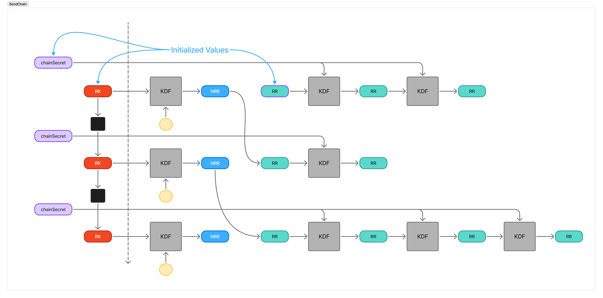

## Abstract

This specification defines Ratcheting Private Identifiers (RPIs), a cryptographic mechanism that enables efficient payload discovery in end-to-end encrypted systems without leaking metadata. RPIs allow recipients to identify which messages are intended for them while maintaining sender anonymity and conversation unlinkability. The mechanism uses key ratcheting to generate single-use identifiers that are transmitted in cleartext but remain meaningless to observers. RPIs provide forward privacy, post-unmasking privacy, and payload unlinkability properties. This specification is designed to integrate with existing encryption protocols such as Double Ratchet, providing a privacy-preserving solution to the key selection problem in multi-sender encrypted messaging systems.

## Background

End-to-end encrypted chat protocols like Double Ratchet provide strong message privacy and forward secrecy.
However, they don't address a fundamental question: how does a recipient know which key to use for decryption?

The problem is similar to receiving an encrypted postcard.
With a single sender, you know who sent it.
With multiple senders, it's unclear whose keys were used during encryption.
Naively including sender information in cleartext leaks metadata, while attempting decryption with every possible key becomes inefficient at scale.
Header encryption techniques can protect additional metadata but don't solve the key selection problem.

In peer-to-peer systems where recipient privacy is desired, messages cannot explicitly identify their intended recipient.
Without a way to determine which messages are intended for them, recipients must attempt to decrypt everything they receive.

Modern chat systems need protection from large-scale collection attacks while delivering efficient user experiences.
This requires a mechanism to associate messages with conversations without leaking metadata or requiring trial decryption.

## Theory 

Ratcheting private identifiers (RPIs) are a means for receiving clients to associate a given payload to an encryption state in a privacy-preserving manner.
RPIs are single-use identifiers transmitted unencrypted alongside encrypted payloads.
The privacy guarantees come from the fact that only conversation participants can derive which RPIs to expect, making the identifiers meaningless to observers.

Both clients maintain a `PI` and `NextPI` for both sending and receiving directions.
By performing a symmetric ratchet step with secret key material (`chainSecret`), clients derive the next `PI` in a chain.
Each ratchet step updates `PI` and derives an RPI by truncating the updated value.

The system integrates with an external encryption mechanism that provides `RK` and `chainSecret`.
When a DH ratchet step occurs, `NextPI` replaces `PI` and a new `NextPI` is derived from the updated `RK`.
This one-step delay ensures receivers maintain continuous knowledge of expected RPIs across ratchet transitions, preventing messages from becoming unidentifiable when chains update.

When a client receives an inbound message, it checks the attached RPI against the set of known RPIs which correspond to its conversations.
If there is a match, the client decrypts the payload using the encryption state associated with that RPI.
If there is no match, the client safely ignores the message as it was not the intended recipient.
To handle dropped or out-of-order messages, clients can precompute several RPIs ahead on the receiving chain.

During initialization, the initiator tells the recipient which `PI` value to use for receiving, as well as which `NextPI` to use for sending.
As the root key ratchets, the values update accordingly.



### Properties

RPI provides the following privacy properties:

**Forward Privacy:** Revealing an identifier today does not reveal identifiers sent previously.
Past identifiers cannot be derived from current ones, even with knowledge of the current identifier value.

**Post-Unmasking Privacy:** The exposure of an identifier does not permanently compromise privacy.
The system eventually transitions to a new derivation state where future identifiers cannot be linked to previously exposed ones.

**Payload Unlinkability:** It cannot be determined from the identifiers alone whether two payloads belong to the same conversation or stream.
Each identifier appears indistinguishable from random to observers who do not possess the secret derivation material.


### Constants

- `OUTPUT_LEN`: Length of RPIs to return in bytes (max=32)
- `DOMAIN_SEP`: String identifying this unique usage context. This MUST be unique for each distinct application or protocol integration.

### State Variables

Each client maintains the following state variables:

- `chainSecret`: Secret key material which uniquely identifies the current epoch
- `PIs`, `PIr`: 32-byte values for sending and receiving private identifier chains
- `NextPIs`, `NextPIr`: Next values for sending and receiving private identifier chains


### Initialization

All parties must agree on a 32-byte `RK` as a prerequisite to initialization.
Both `RK` and `chainSecret` are obtained from the external encryption mechanism.
The sender calls `RPI_INIT_SEND` to initialize their instance and the recipient calls `RPI_INIT_RECV`.

```
RPI_INIT_SEND(state, RK, SEED_PI, SEED_NEXT_PI, chainSecret):
  state.PIs = SEED_PI
  state.NextPIs = HKDF-Extract(RK, state.DOMAIN_SEP)
  state.PIr = none
  state.NextPIr = SEED_NEXT_PI
  state.chainSecretSend = chainSecret
  state.chainSecretRecv = none

RPI_INIT_RECV(state, RK, SEED_PI, SEED_NEXT_PI, chainSecret):
  state.PIs = none
  state.NextPIs = SEED_NEXT_PI
  state.PIr = SEED_PI
  state.NextPIr = HKDF-Extract(RK, state.DOMAIN_SEP)
  state.chainSecretSend = none
  state.chainSecretRecv = chainSecret
```

### Chain Initialization

When `RK` is ratcheted there MUST be a corresponding call to `RPI_RESEED` depending on which chain `RK` corresponds to.
```
RPI_RESEED_SEND(state, RK, chainSecret):
  state.PIs = state.NextPIs
  state.NextPIs = HKDF-Extract(RK, state.DOMAIN_SEP)
  state.chainSecretSend = chainSecret

RPI_RESEED_RECV(state, RK, chainSecret):
  state.PIr = state.NextPIr
  state.NextPIr = HKDF-Extract(RK, state.DOMAIN_SEP)
  state.chainSecretRecv = chainSecret
```

### RPI Derivation

An RPI is generated by calling `RPI_DERIVE`.
Each call ratchets the current `PI` value and returns an RPI truncated to the configured length.
```
TRUNCATE(V, N):
  return V[0:N]

RPI_DERIVE_SEND(state):
  state.PIs = HKDF-Extract(state.PIs, state.chainSecretSend)
  rpi = TRUNCATE(state.PIs, OUTPUT_LEN)
  return rpi

RPI_DERIVE_RECV(state):
  state.PIr = HKDF-Extract(state.PIr, state.chainSecretRecv)
  rpi = TRUNCATE(state.PIr, OUTPUT_LEN)
  return rpi
```
TODO: These functions are the same. Can this spec be flattened to only define a single chain rather than both send & recv

## Implementation Suggestions

### Truncation

Depending on the application, it may be desirable to truncate RPIs to save on bandwidth and storage requirements.
Reducing `OUTPUT_LEN` increases the likelihood of collisions.
A single RPI value appearing in multiple conversations is not a critical failure, but may result in decryption errors and UX implications.
`OUTPUT_LEN` should be chosen such that collisions are sufficiently improbable for the given broadcast domain.


### Caching Precomputed Identifiers

It can be advantageous to precompute RPIs from the receiving chain to make identifying inbound payloads easier.
As messages may not arrive in order (or at all), precomputing a set of RPIs allows for matches even when payloads are dropped or reordered.
How many RPIs to precompute is a receiving-side implementation detail that depends on network characteristics and the encryption scheme being used.
As an upper bound, protocols such as Double Ratchet limit the number of skipped messages per chain.
Exceeding this number provides no benefit, as the receiving client would not be able to decrypt the messages regardless.


### RPI Deletion

RPIs can be deleted once they are no longer relevant.
Relevancy depends on the system they are integrated with.
In the case of Double Ratchet, the RPI lifetime matches that of the chain key.
If all keys from a chain can be deleted, then the RPIs corresponding to that chain can also be deleted. 


## Security/Privacy Considerations

### RPI Values are Public

RPI values are transmitted in cleartext alongside encrypted payloads and MUST NOT be used as cryptographic keys or for any other cryptographic derivations.
The privacy properties rely on the secrecy of the input key material (`RK` and `chainSecret`), not the secrecy of the derived RPI values themselves.

### RPI Reuse

Using the same RPI for different messages within the same stream is not a critical failure, but does violate the unlinkability property of payloads.
Depending on the application, duplicate RPIs could link messages to the same conversation and reveal conversation activity.
To maintain unlinkability, each RPI SHOULD appear only once in a conversation.

### Domain Separation

Implementors MUST ensure that `DOMAIN_SEP` is never reused in any other cryptographic derivations within the same system.
Reuse of `DOMAIN_SEP` across different contexts may reveal cryptographic key material or compromise the privacy properties of the system.


## Copyright

Copyright and related rights waived via [CC0](https://creativecommons.org/publicdomain/zero/1.0/).

## References

A list of references.